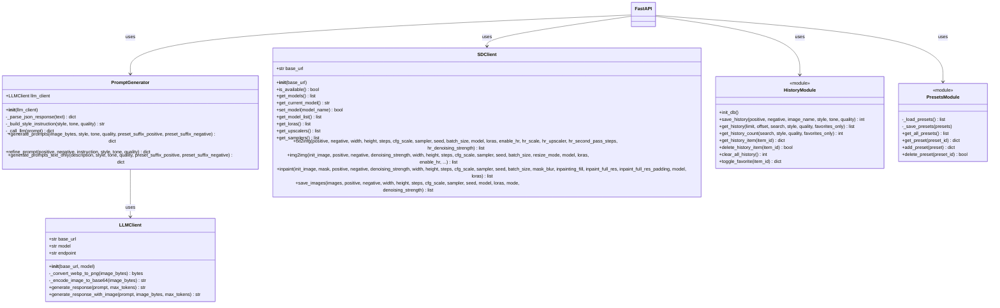
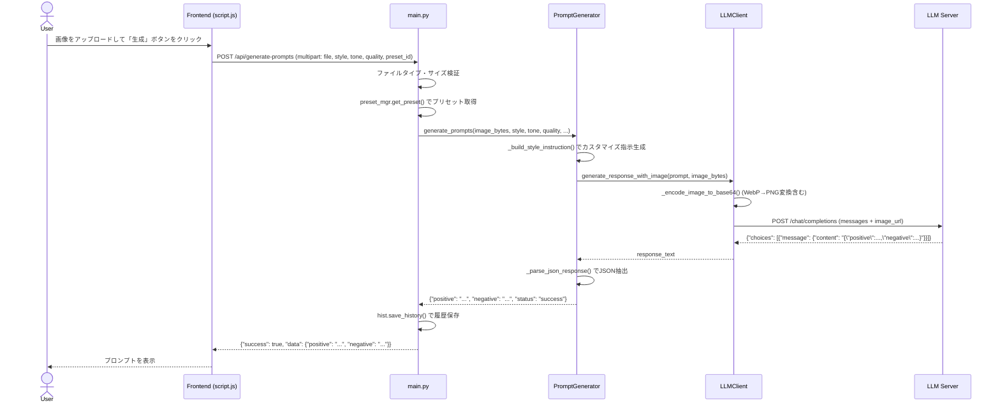
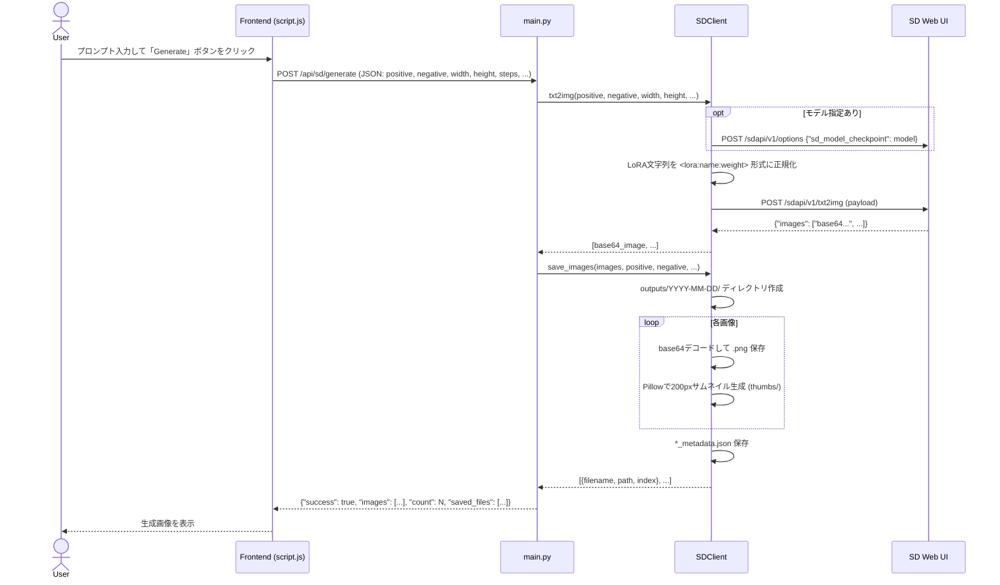
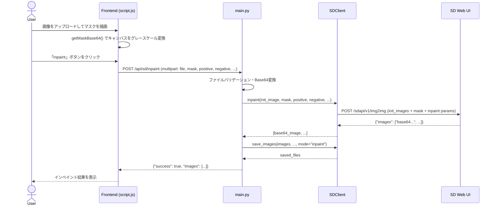
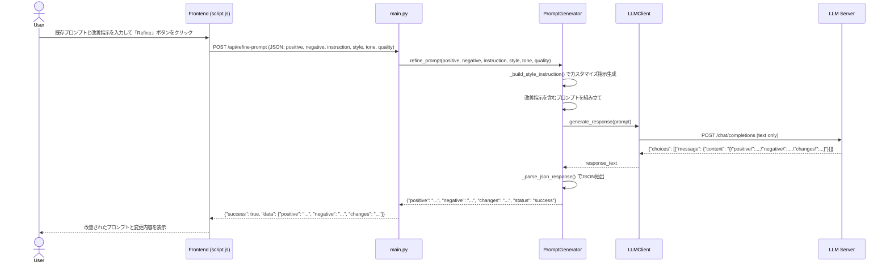
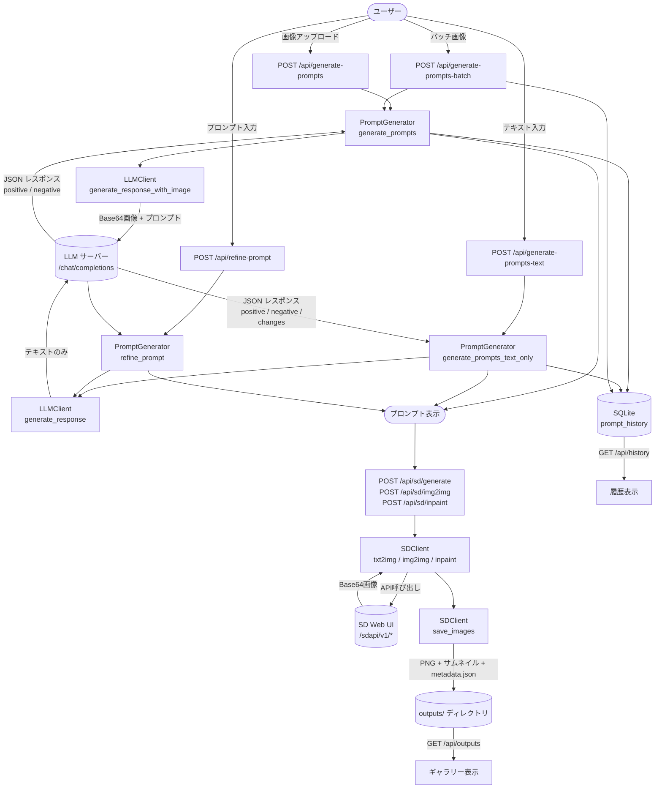
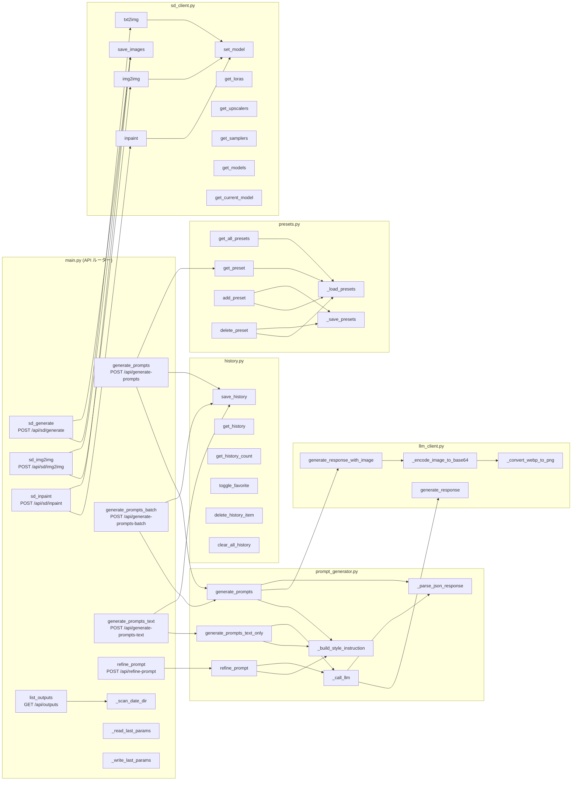

# Img2sdtxt 実装ドキュメント

## 目次

1. [システム概要](#システム概要)
2. [アーキテクチャ図](#アーキテクチャ図)
3. [クラス図](#クラス図)
4. [モジュール別関数リファレンス](#モジュール別関数リファレンス)
   - [config.py](#configpy)
   - [llm_client.py — LLMClient クラス](#llm_clientpy--llmclient-クラス)
   - [prompt_generator.py — PromptGenerator クラス](#prompt_generatorpy--promptgenerator-クラス)
   - [sd_client.py — SDClient クラス](#sd_clientpy--sdclient-クラス)
   - [history.py](#historypy)
   - [presets.py](#presetspy)
   - [main.py — FastAPI アプリケーション](#mainpy--fastapi-アプリケーション)
5. [シーケンス図](#シーケンス図)
6. [API エンドポイント一覧](#api-エンドポイント一覧)
7. [データフロー図](#データフロー図)
8. [コール・グラフ](#コールグラフ)

---

## システム概要

**Img2sdtxt** は、ローカル LLM（LM Studio / Lemonade）を使って画像やテキストから Stable Diffusion 用プロンプトを生成する Web アプリケーションです。バックエンドは FastAPI（Python）、フロントエンドはバニラ HTML/CSS/JS で構成されています。生成されたプロンプトは AUTOMATIC1111 Stable Diffusion Web UI API に送信して画像を生成することもできます。

```
ユーザー
  │
  ▼
[ブラウザ (static/index.html + script.js)]
  │  HTTP/REST
  ▼
[FastAPI バックエンド (main.py)]
  ├─── LLMClient ────▶ LLM サーバー (LM Studio / Lemonade)
  ├─── PromptGenerator（LLMClient を利用）
  ├─── SDClient ─────▶ Stable Diffusion Web UI (AUTOMATIC1111)
  ├─── history (SQLite)
  └─── presets (JSON ファイル)
```

---

## アーキテクチャ図

```mermaid
graph TB
    subgraph Browser["ブラウザ (Frontend)"]
        UI[HTML / CSS]
        JS[script.js]
    end

    subgraph Backend["FastAPI バックエンド (main.py)"]
        API[API ルーター]
        PG[PromptGenerator]
        LC[LLMClient]
        SD[SDClient]
        HI[history モジュール]
        PR[presets モジュール]
        LP[last-params (JSON)]
    end

    subgraph Storage["ストレージ"]
        DB[(SQLite\nhistory.db)]
        PJ[(presets.json)]
        LJ[(last_params.json)]
        OUT[(outputs/\n生成画像)]
    end

    subgraph External["外部サービス"]
        LLM[LLM サーバー\nLM Studio / Lemonade\n:1234/v1]
        SDUI[Stable Diffusion Web UI\nAUTOMATIC1111\n:7860]
    end

    UI --> JS
    JS -->|HTTP REST| API
    API --> PG
    API --> SD
    API --> HI
    API --> PR
    API --> LP
    PG --> LC
    LC -->|OpenAI 互換 API\n/chat/completions| LLM
    SD -->|SDAPI\n/sdapi/v1/*| SDUI
    HI --> DB
    PR --> PJ
    LP --> LJ
    SD --> OUT
```

---

## クラス図



---

## モジュール別関数リファレンス

---

### config.py

設定値の定義とロードを行うモジュール。`.env` ファイルを読み込み、各種設定定数を公開します。

| 定数 | 型 | デフォルト値 | 説明 |
|------|-----|-------------|------|
| `LLM_SERVER_URL` | `str` | `http://localhost:1234/v1` | LLM サーバーのベース URL |
| `LLM_MODEL` | `str` | `gpt-3.5-turbo` | 使用する LLM モデル名 |
| `SD_API_URL` | `str` | `http://localhost:7860` | Stable Diffusion Web UI の URL |
| `SD_OUTPUT_DIR` | `Path` | `outputs/` | 生成画像の保存先ディレクトリ |
| `API_HOST` | `str` | `0.0.0.0` | FastAPI バインドホスト |
| `API_PORT` | `int` | `8000` | FastAPI バインドポート |
| `DEBUG` | `bool` | `False` | デバッグモード |
| `MAX_IMAGE_SIZE` | `int` | `10485760` (10MB) | 許容最大アップロードサイズ |
| `ALLOWED_IMAGE_TYPES` | `list` | JPEG/PNG/WebP/GIF | 許容 MIME タイプ一覧 |
| `STYLES` | `list` | 8 スタイル | プロンプトスタイル選択肢 |
| `TONES` | `list` | 8 トーン | プロンプトトーン選択肢 |
| `QUALITY_LEVELS` | `dict` | standard/high/ultra | 品質タグマッピング |

---

### llm_client.py — LLMClient クラス

ローカル LLM サーバー（LM Studio / Lemonade）と通信するクライアントクラスです。OpenAI 互換の `/chat/completions` エンドポイントを使用します。

#### `__init__(base_url, model)`

| 項目 | 内容 |
|------|------|
| **引数** | `base_url: str` — LLM サーバーの URL（デフォルト: `config.LLM_SERVER_URL`）<br>`model: str` — モデル名（デフォルト: `config.LLM_MODEL`） |
| **戻り値** | なし |
| **処理内容** | `base_url`、`model`、エンドポイント URL (`{base_url}/chat/completions`) をインスタンス変数に設定する。 |

#### `_convert_webp_to_png(image_bytes) → bytes`

| 項目 | 内容 |
|------|------|
| **引数** | `image_bytes: bytes` — 入力画像のバイト列 |
| **戻り値** | `bytes` — PNG 形式のバイト列（WebP の場合）または元のバイト列 |
| **処理内容** | Pillow で画像を開き、フォーマットが `WEBP` の場合のみ PNG に変換する。透明度チャンネル（RGBA/LA/P）がある場合はそのまま PNG 保存、それ以外は RGB 変換後に保存。変換失敗時は警告を出力し元データを返す。 |

#### `_encode_image_to_base64(image_bytes) → str`

| 項目 | 内容 |
|------|------|
| **引数** | `image_bytes: bytes` — 入力画像のバイト列 |
| **戻り値** | `str` — Base64 エンコード済み文字列 |
| **処理内容** | `_convert_webp_to_png()` で WebP→PNG 変換を行い、`base64.b64encode()` でエンコードして UTF-8 文字列として返す。 |

#### `generate_response(prompt, max_tokens=500) → Optional[str]`

| 項目 | 内容 |
|------|------|
| **引数** | `prompt: str` — ユーザープロンプト<br>`max_tokens: int` — 最大生成トークン数 |
| **戻り値** | `str` — LLM のレスポンステキスト、取得失敗時は `None` |
| **例外** | `ConnectionError` — サーバー接続失敗<br>`TimeoutError` — タイムアウト (30秒)<br>`Exception` — その他 LLM エラー |
| **処理内容** | システムプロンプト（SD プロンプト生成専門家）とユーザープロンプトを含む payload を構築し、`/chat/completions` に POST する。temperature=0.7、top_p=0.9 で生成。レスポンスの `choices[0].message.content` を返す。 |

#### `generate_response_with_image(prompt, image_bytes, max_tokens=500) → Optional[str]`

| 項目 | 内容 |
|------|------|
| **引数** | `prompt: str` — ユーザープロンプト<br>`image_bytes: bytes` — 分析対象の画像バイト列<br>`max_tokens: int` — 最大生成トークン数 |
| **戻り値** | `str` — LLM のレスポンステキスト、取得失敗時は `None` |
| **例外** | `ConnectionError` / `TimeoutError`（60秒）/ `Exception` |
| **処理内容** | `_encode_image_to_base64()` で画像を Base64 変換後、OpenAI Vision API 形式（`content: [{type: text}, {type: image_url}]`）のマルチモーダル payload を構築して POST する。 |

---

### prompt_generator.py — PromptGenerator クラス

LLM を利用して Stable Diffusion 用プロンプトを生成・改善するクラスです。

#### `__init__(llm_client)`

| 項目 | 内容 |
|------|------|
| **引数** | `llm_client: LLMClient` — 使用する LLM クライアント |
| **処理内容** | `llm_client` をインスタンス変数に格納する。 |

#### `_parse_json_response(text) → dict`

| 項目 | 内容 |
|------|------|
| **引数** | `text: str` — LLM の生レスポンス文字列 |
| **戻り値** | `dict` — パース済みの JSON オブジェクト |
| **処理内容** | ` ```json ... ``` ` または ` ``` ... ``` ` で囲まれたコードブロックを除去した後、`json.loads()` でパースする。LLM がコードブロック付きで JSON を返す場合に対応。 |

#### `_build_style_instruction(style, tone, quality) → str`

| 項目 | 内容 |
|------|------|
| **引数** | `style: str` — スタイルコード<br>`tone: str` — トーンコード<br>`quality: str` — 品質レベルコード |
| **戻り値** | `str` — LLM へのカスタマイズ指示文（改行区切り） |
| **処理内容** | `style_map`・`tone_map` で各コードを日本語説明に変換し、`QUALITY_LEVELS` から品質タグを取得してプロンプト指示テキストを組み立てる。 |

#### `_call_llm(prompt) → dict`

| 項目 | 内容 |
|------|------|
| **引数** | `prompt: str` — LLM に送るプロンプト |
| **戻り値** | `dict` — パース済みの JSON レスポンス |
| **処理内容** | `llm_client.generate_response()` を呼び出し、レスポンスが空なら `ValueError` を投げる。取得できた場合は `_parse_json_response()` でパースして返す。 |

#### `generate_prompts(image_bytes, style, tone, quality, preset_suffix_positive, preset_suffix_negative) → dict`

| 項目 | 内容 |
|------|------|
| **引数** | `image_bytes: bytes` — 分析する画像<br>`style/tone/quality: str` — カスタマイズ設定<br>`preset_suffix_positive/negative: str` — プリセットの接尾タグ |
| **戻り値** | `{"positive": str, "negative": str, "status": "success"}` または `{"status": "error", "error": str}` |
| **処理内容** | `_build_style_instruction()` でカスタマイズ指示を生成し、画像分析プロンプト（JSON 形式での返答を要求）を組み立てる。`llm_client.generate_response_with_image()` で LLM を呼び出し、JSON をパースしてポジティブ・ネガティブプロンプトを取得。プリセット接尾タグがある場合は末尾に追加する。 |

#### `refine_prompt(positive, negative, instruction, style, tone, quality) → dict`

| 項目 | 内容 |
|------|------|
| **引数** | `positive: str` — 既存ポジティブプロンプト<br>`negative: str` — 既存ネガティブプロンプト<br>`instruction: str` — 改善指示<br>`style/tone/quality: str` — カスタマイズ設定 |
| **戻り値** | `{"positive": str, "negative": str, "changes": str, "status": "success"}` または `{"status": "error", ...}` |
| **処理内容** | 現在のプロンプトと改善ポイント（タグ追加・最適化・重複整理・順序整理）を含むプロンプトを組み立て、`_call_llm()` で LLM に改善を依頼する。エラー時は入力プロンプトをそのまま返す。 |

#### `generate_prompts_text_only(description, style, tone, quality, preset_suffix_positive, preset_suffix_negative) → dict`

| 項目 | 内容 |
|------|------|
| **引数** | `description: str` — 生成したい画像のテキスト説明<br>`style/tone/quality: str` — カスタマイズ設定<br>`preset_suffix_positive/negative: str` — プリセット接尾タグ |
| **戻り値** | `{"positive": str, "negative": str, "status": "success"}` または `{"status": "error", ...}` |
| **処理内容** | テキスト説明とカスタマイズ設定を含むプロンプトを組み立て、`_call_llm()` でテキストのみの LLM 呼び出しを行う。プリセット接尾タグがある場合は末尾に追加する。 |

---

### sd_client.py — SDClient クラス

AUTOMATIC1111 Stable Diffusion Web UI の REST API クライアントです。

#### `__init__(base_url)`

| 項目 | 内容 |
|------|------|
| **引数** | `base_url: str` — SD Web UI の URL（デフォルト: `config.SD_API_URL`） |
| **処理内容** | `base_url` を末尾スラッシュ除去の上で保存し、`SD_OUTPUT_DIR` を作成する。 |

#### `is_available() → bool`

| 項目 | 内容 |
|------|------|
| **戻り値** | `bool` — SD API が応答可能なら `True` |
| **処理内容** | `/sdapi/v1/sd-models` に GET リクエスト（タイムアウト 5 秒）を送り、ステータスコード 200 なら `True` を返す。例外発生時は `False`。 |

#### `get_models() → List[Dict]`

| 項目 | 内容 |
|------|------|
| **戻り値** | `list` — チェックポイントモデルの辞書リスト |
| **処理内容** | `/sdapi/v1/sd-models` から利用可能なモデル一覧を取得して返す。 |

#### `get_current_model() → str`

| 項目 | 内容 |
|------|------|
| **戻り値** | `str` — 現在ロード中のモデル名、取得失敗時は空文字 |
| **処理内容** | `/sdapi/v1/options` から `sd_model_checkpoint` の値を取得して返す。 |

#### `set_model(model_name) → bool`

| 項目 | 内容 |
|------|------|
| **引数** | `model_name: str` — 切り替え先のモデル名 |
| **戻り値** | `bool` — 成功なら `True`、失敗なら `False` |
| **処理内容** | `/sdapi/v1/options` に `{"sd_model_checkpoint": model_name}` を POST してモデルを切り替える（タイムアウト 30 秒）。 |

#### `get_model_list() → List[Dict]`

`get_models()` と同一処理。ハッシュと名前付きのモデルリストを返します。

#### `get_loras() → List[Dict]`

| 項目 | 内容 |
|------|------|
| **戻り値** | `list` — LoRA モジュールの辞書リスト（取得失敗時は空リスト） |
| **処理内容** | `/sdapi/v1/loras` からリストを取得して返す。レスポンス形式が不正な場合や例外時は空リストを返す。 |

#### `get_upscalers() → List[str]`

| 項目 | 内容 |
|------|------|
| **戻り値** | `list` — アップスケーラー名の文字列リスト |
| **処理内容** | `/sdapi/v1/upscalers` から取得。失敗時はデフォルトの 14 種類のアップスケーラー名を返す。 |

#### `get_samplers() → List[str]`

| 項目 | 内容 |
|------|------|
| **戻り値** | `list` — サンプラー名の文字列リスト |
| **処理内容** | `/sdapi/v1/samplers` から取得。失敗時は `["Euler a", "Euler", "DPM++ 2M Karras", "DDIM"]` を返す。 |

#### `txt2img(...) → List[str]`

| 項目 | 内容 |
|------|------|
| **引数** | `positive/negative: str` — プロンプト<br>`width/height: int` — 出力サイズ<br>`steps: int` — サンプリングステップ数<br>`cfg_scale: float` — CFG スケール<br>`sampler: str` — サンプラー名<br>`seed: int` — シード値（-1 でランダム）<br>`batch_size: int` — 一度に生成する枚数<br>`model: str` — 使用モデル名（空なら現在のまま）<br>`loras: str` — LoRA 指定文字列<br>`enable_hr: bool` — Hires.fix 有効化<br>`hr_scale/hr_upscaler/hr_second_pass_steps/hr_denoising_strength` — Hires.fix 設定 |
| **戻り値** | `list` — Base64 エンコードされた生成画像のリスト |
| **例外** | `ConnectionError` / `TimeoutError`（120秒）/ `Exception` |
| **処理内容** | モデル指定があれば `set_model()` で切り替え。LoRA 文字列を `"lora1:1.0,lora2:0.8"` 形式から `"<lora:lora1:1.0><lora:lora2:0.8>"` 形式に正規化してプロンプトの先頭に付加。payload を組み立てて `/sdapi/v1/txt2img` に POST し、`images` フィールドを返す。 |

#### `img2img(...) → List[str]`

| 項目 | 内容 |
|------|------|
| **引数** | `init_image: str` — Base64 エンコード済み入力画像<br>`denoising_strength: float` — 変化の強さ（0.0〜1.0）<br>`resize_mode: int` — リサイズモード（0=そのまま/1=クロップ&リサイズ/2=リサイズ&フィル）<br>その他は `txt2img` と同様 |
| **戻り値** | `list` — Base64 エンコードされた生成画像のリスト |
| **例外** | `ConnectionError` / `TimeoutError`（180秒）/ `Exception` |
| **処理内容** | `txt2img` と同様の前処理後、`init_images` フィールドに入力画像を含めて `/sdapi/v1/img2img` に POST する。 |

#### `inpaint(...) → List[str]`

| 項目 | 内容 |
|------|------|
| **引数** | `init_image: str` — Base64 エンコード済み入力画像<br>`mask: str` — Base64 エンコード済みマスク（白=描き直す領域、黒=保持する領域）<br>`mask_blur: int` — マスクのぼかし半径<br>`inpainting_fill: int` — 0=塗りつぶし/1=元画像/2=潜在ノイズ/3=潜在ゼロ<br>`inpaint_full_res: bool` — マスク領域のみをフル解像度でインペイント<br>`inpaint_full_res_padding: int` — マスク周囲パディング |
| **戻り値** | `list` — Base64 エンコードされた生成画像のリスト |
| **例外** | `ConnectionError` / `TimeoutError`（180秒）/ `Exception` |
| **処理内容** | `img2img` と同様の処理だが `mask` フィールドを追加し、インペイント固有パラメータを含めて `/sdapi/v1/img2img` に POST する。 |

#### `save_images(images, positive, negative, width, height, steps, cfg_scale, sampler, seed, model, loras, mode, denoising_strength) → List[Dict]`

| 項目 | 内容 |
|------|------|
| **引数** | `images: list` — Base64 エンコードされた画像リスト<br>`mode: str` — `"txt2img"` / `"img2img"` / `"inpaint"`<br>その他は生成時のパラメータ |
| **戻り値** | `list` — 保存された各ファイルの情報（`filename`, `path`, `index`）の辞書リスト |
| **処理内容** | タイムスタンプと日付で `outputs/YYYY-MM-DD/` サブフォルダを作成。各画像を `{prefix}_{timestamp}_{index:03d}.png` として保存。Pillow で 200px サムネイルを `thumbs/` サブフォルダに生成（JPEG 品質 80）。全画像のメタデータ（パラメータ、ファイルリスト）を `{prefix}_{timestamp}_metadata.json` として保存する。 |

---

### history.py

SQLite を用いてプロンプト履歴を管理するモジュールです。DB パスは `data/history.db`。

#### データベーススキーマ

```sql
CREATE TABLE prompt_history (
    id         INTEGER PRIMARY KEY AUTOINCREMENT,
    image_name TEXT,
    positive   TEXT NOT NULL,
    negative   TEXT NOT NULL,
    style      TEXT,
    tone       TEXT,
    quality    TEXT,
    created_at TEXT NOT NULL,
    is_favorite INTEGER NOT NULL DEFAULT 0
)
```

#### `init_db()`

| 項目 | 内容 |
|------|------|
| **処理内容** | `data/` ディレクトリを作成し、テーブルが存在しなければ `CREATE TABLE IF NOT EXISTS` で作成する。既存 DB に `is_favorite` カラムがない場合は `ALTER TABLE ADD COLUMN` でマイグレーションする（既存カラム時は `OperationalError` を無視）。 |

#### `save_history(positive, negative, image_name, style, tone, quality) → int`

| 項目 | 内容 |
|------|------|
| **引数** | `positive/negative: str` — プロンプト<br>`image_name: str` — 元画像ファイル名（省略可）<br>`style/tone/quality: str` — 使用した設定 |
| **戻り値** | `int` — 挿入された行の ID |
| **処理内容** | `init_db()` 後、現在の ISO 8601 タイムスタンプとともにレコードを INSERT し、`lastrowid` を返す。 |

#### `get_history(limit, offset, search, style, quality, favorites_only) → List[Dict]`

| 項目 | 内容 |
|------|------|
| **引数** | `limit: int` — 取得件数（デフォルト 50）<br>`offset: int` — オフセット<br>`search: str` — 全文検索キーワード<br>`style/quality: str` — フィルタ条件<br>`favorites_only: bool` — お気に入りのみ |
| **戻り値** | `list` — 辞書リスト（`created_at` 降順） |
| **処理内容** | 検索条件を動的に WHERE 句に組み立て（`positive`/`negative`/`image_name` の LIKE 検索）、`ORDER BY created_at DESC LIMIT ? OFFSET ?` でページネーション付きで取得する。 |

#### `get_history_count(search, style, quality, favorites_only) → int`

| 項目 | 内容 |
|------|------|
| **戻り値** | `int` — フィルタ条件に一致する総件数 |
| **処理内容** | `get_history()` と同じ WHERE 句を使って `SELECT COUNT(*)` を実行する。 |

#### `get_history_item(item_id) → Optional[Dict]`

| 項目 | 内容 |
|------|------|
| **引数** | `item_id: int` — 取得する履歴の ID |
| **戻り値** | `dict` — 単一レコードの辞書、存在しない場合は `None` |
| **処理内容** | `WHERE id = ?` で1件取得して辞書で返す。 |

#### `delete_history_item(item_id) → bool`

| 項目 | 内容 |
|------|------|
| **引数** | `item_id: int` — 削除する履歴の ID |
| **戻り値** | `bool` — 削除成功なら `True`、対象なしなら `False` |
| **処理内容** | `DELETE FROM ... WHERE id = ?` を実行し、`rowcount > 0` で成否を返す。 |

#### `clear_all_history() → int`

| 項目 | 内容 |
|------|------|
| **戻り値** | `int` — 削除されたレコード数 |
| **処理内容** | `DELETE FROM prompt_history` で全件削除し、`rowcount` を返す。 |

#### `toggle_favorite(item_id) → Optional[Dict]`

| 項目 | 内容 |
|------|------|
| **引数** | `item_id: int` — 対象履歴の ID |
| **戻り値** | `dict` — 更新後のレコード辞書、存在しない場合は `None` |
| **処理内容** | 現在の `is_favorite` を読み取り、`0→1`/`1→0` をトグルして UPDATE する。更新後のレコードを再取得して返す。 |

---

### presets.py

プロンプトプリセットテンプレートを管理するモジュールです。ストレージは `data/presets.json`。12 種類のデフォルトプリセット（Anime/Photorealistic/Oil Painting/Watercolor/Fantasy/Portrait 等）を内包します。

#### `_load_presets() → List[Dict]`

| 項目 | 内容 |
|------|------|
| **戻り値** | `list` — プリセット辞書のリスト |
| **処理内容** | `data/presets.json` が存在すればそれを読み込んで返す。読み込み失敗またはファイル未存在の場合は `DEFAULT_PRESETS` を返す。 |

#### `_save_presets(presets)`

| 項目 | 内容 |
|------|------|
| **引数** | `presets: list` — 保存するプリセット一覧 |
| **処理内容** | `data/` ディレクトリを作成後、JSON（`ensure_ascii=False`, インデント 2）として `presets.json` に書き込む。 |

#### `get_all_presets() → List[Dict]`

| 項目 | 内容 |
|------|------|
| **戻り値** | `list` — 全プリセットのリスト |
| **処理内容** | `_load_presets()` を呼び出して返す。 |

#### `get_preset(preset_id) → Optional[Dict]`

| 項目 | 内容 |
|------|------|
| **引数** | `preset_id: str` — プリセット ID |
| **戻り値** | `dict` — 該当プリセット、見つからない場合は `None` |
| **処理内容** | `_load_presets()` のリストから `id` 一致するものを `next()` で返す。 |

#### `add_preset(preset) → Dict`

| 項目 | 内容 |
|------|------|
| **引数** | `preset: dict` — 追加するプリセット（`id` は省略可能） |
| **戻り値** | `dict` — 追加されたプリセット（ID 付き） |
| **処理内容** | `id` が未設定の場合は `uuid.uuid4()` の先頭 8 文字を割り当て。`is_default=False` を設定してリストに追加後、`_save_presets()` で保存する。 |

#### `delete_preset(preset_id) → bool`

| 項目 | 内容 |
|------|------|
| **引数** | `preset_id: str` — 削除するプリセット ID |
| **戻り値** | `bool` — 削除成功なら `True`、デフォルトプリセットまたは未存在なら `False` |
| **処理内容** | `is_default=False` かつ `id` 一致するプリセットのみをリストから除外する。リスト長が変化した場合のみ `_save_presets()` で保存して `True` を返す。 |

---

### main.py — FastAPI アプリケーション

FastAPI アプリケーションのエントリポイント。全 API エンドポイントを定義し、各モジュールをオーケストレーションします。

#### アプリ初期化

| 項目 | 内容 |
|------|------|
| **処理内容** | FastAPI インスタンスを作成し、CORS ミドルウェアを全オリジン許可で設定。`llm_client`・`prompt_generator`・`sd_client` のインスタンスを生成。`/static`・`/outputs` を静的ファイルとしてマウント。 |

#### `root() → FileResponse`

`GET /`

| 項目 | 内容 |
|------|------|
| **処理内容** | `static/index.html` をレスポンスとして返す。 |

#### `health_check() → dict`

`GET /health`

| 項目 | 内容 |
|------|------|
| **処理内容** | `llm_client.generate_response("Hello")` を呼び出して LLM 接続を確認。成功すれば `{"status": "healthy"}` を返す。接続エラー時は 503 を返す。 |

#### `get_config() → dict`

`GET /api/config`

| 項目 | 内容 |
|------|------|
| **処理内容** | LLM サーバー URL、モデル名、SD API URL、スタイル/トーン/品質レベル一覧を返す。 |

#### `generate_prompts(...) → dict`

`POST /api/generate-prompts` (multipart/form-data)

| 項目 | 内容 |
|------|------|
| **引数** | `file` — アップロード画像<br>`style/tone/quality/preset_id` — カスタマイズ設定<br>`save_history: bool` — 履歴保存フラグ |
| **処理内容** | ① ファイルタイプ・サイズ検証 → ② `preset_mgr.get_preset()` でプリセット取得 → ③ `prompt_generator.generate_prompts()` でプロンプト生成 → ④ `save_history=True` なら `hist.save_history()` で保存 → ⑤ `{"positive", "negative"}` を返す。 |

#### `generate_prompts_batch(...) → dict`

`POST /api/generate-prompts-batch` (multipart/form-data)

| 項目 | 内容 |
|------|------|
| **引数** | `files` — 最大 10 枚の画像リスト、その他は `generate_prompts` と同様 |
| **処理内容** | 各画像に対してバリデーション → `prompt_generator.generate_prompts()` → `hist.save_history()` を繰り返し、全件の結果リストを返す。 |

#### `generate_prompts_text(...) → dict`

`POST /api/generate-prompts-text` (JSON)

| 項目 | 内容 |
|------|------|
| **引数** | `description: str` — テキスト説明（必須）、その他は `generate_prompts` と同様 |
| **処理内容** | `description` の空チェック後、`prompt_generator.generate_prompts_text_only()` を呼び出してプロンプトを返す。 |

#### `refine_prompt(...) → dict`

`POST /api/refine-prompt` (JSON)

| 項目 | 内容 |
|------|------|
| **引数** | `positive: str` — 既存プロンプト（必須）、`negative/instruction/style/tone/quality` |
| **処理内容** | `prompt_generator.refine_prompt()` を呼び出し、改善されたプロンプトと変更内容の説明を返す。 |

#### `get_history(...) → dict`

`GET /api/history`

| 項目 | 内容 |
|------|------|
| **処理内容** | クエリパラメータ（`limit`, `offset`, `search`, `style`, `quality`, `favorites_only`）を `hist.get_history()` と `hist.get_history_count()` に渡し、結果と総件数を返す。 |

#### `export_history() → JSONResponse`

`GET /api/history/export`

| 項目 | 内容 |
|------|------|
| **処理内容** | 最大 10,000 件の履歴を `Content-Disposition: attachment` ヘッダ付きの JSON としてダウンロードさせる。 |

#### `toggle_history_favorite(item_id) → dict`

`PUT /api/history/{item_id}/favorite`

| 項目 | 内容 |
|------|------|
| **処理内容** | `hist.toggle_favorite()` でお気に入り状態をトグル。対象なしは 404。 |

#### `delete_history(item_id) → dict`

`DELETE /api/history/{item_id}`

| 項目 | 内容 |
|------|------|
| **処理内容** | `hist.delete_history_item()` で1件削除。対象なしは 404。 |

#### `clear_history() → dict`

`DELETE /api/history`

| 項目 | 内容 |
|------|------|
| **処理内容** | `hist.clear_all_history()` で全件削除し、削除件数を返す。 |

#### `get_presets() → dict`

`GET /api/presets`

| 項目 | 内容 |
|------|------|
| **処理内容** | `preset_mgr.get_all_presets()` で全プリセットを返す。 |

#### `create_preset(preset) → dict`

`POST /api/presets` (JSON)

| 項目 | 内容 |
|------|------|
| **処理内容** | `name`, `positive_suffix`, `negative_suffix` の必須チェック後、`preset_mgr.add_preset()` で追加して返す。 |

#### `delete_preset(preset_id) → dict`

`DELETE /api/presets/{preset_id}`

| 項目 | 内容 |
|------|------|
| **処理内容** | `preset_mgr.delete_preset()` でカスタムプリセットを削除。デフォルトまたは未存在は 400。 |

#### `sd_status() → dict`

`GET /api/sd/status`

| 項目 | 内容 |
|------|------|
| **処理内容** | `sd_client.is_available()` で接続確認。接続可能時は `get_current_model()`・`get_samplers()`・`get_model_list()`・`get_upscalers()`・`get_loras()` を順に呼び出してまとめて返す。 |

#### `sd_loras_list() → dict`

`GET /api/sd/loras`

| 項目 | 内容 |
|------|------|
| **処理内容** | `sd_client.get_loras()` で LoRA 一覧を取得して返す。エラー時は 503。 |

#### `sd_upscalers() → dict`

`GET /api/sd/upscalers`

| 項目 | 内容 |
|------|------|
| **処理内容** | `sd_client.get_upscalers()` でアップスケーラー一覧を取得して返す。 |

#### `sd_generate(request_data) → dict`

`POST /api/sd/generate` (JSON)

| 項目 | 内容 |
|------|------|
| **処理内容** | JSON から全生成パラメータを取得（`batch_size` は最大 4 に制限）。`sd_client.txt2img()` で画像を生成し、`sd_client.save_images()` で自動保存。生成画像（Base64）とファイル情報を返す。 |

#### `sd_img2img(...) → dict`

`POST /api/sd/img2img` (multipart/form-data)

| 項目 | 内容 |
|------|------|
| **処理内容** | アップロード画像をバリデーション後 Base64 変換し、`sd_client.img2img()` で変換。`sd_client.save_images(mode="img2img")` で保存。 |

#### `sd_inpaint(...) → dict`

`POST /api/sd/inpaint` (multipart/form-data)

| 項目 | 内容 |
|------|------|
| **処理内容** | アップロード画像をバリデーション後 Base64 変換し、フォームの `mask`（Base64 文字列）と合わせて `sd_client.inpaint()` を呼び出す。`sd_client.save_images(mode="inpaint")` で保存。 |

#### `sd_models() → dict`

`GET /api/sd/models`

| 項目 | 内容 |
|------|------|
| **処理内容** | `sd_client.get_models()` でモデル名一覧を返す。 |

#### `_read_last_params() → dict`

| 項目 | 内容 |
|------|------|
| **処理内容** | `data/last_params.json` を読み込んで辞書を返す。ファイル未存在・パースエラー時は空辞書を返す。 |

#### `_write_last_params(data)`

| 項目 | 内容 |
|------|------|
| **処理内容** | `data/` ディレクトリを作成後、辞書を JSON として `last_params.json` に書き込む。 |

#### `get_last_params(feature) → dict`

`GET /api/last-params/{feature}`

| 項目 | 内容 |
|------|------|
| **処理内容** | `feature` が `{generate, sd, img2img, inpaint}` のいずれかであることを検証後、`_read_last_params()` から対応するパラメータを返す。 |

#### `save_last_params(feature, request_data) → dict`

`POST /api/last-params/{feature}`

| 項目 | 内容 |
|------|------|
| **処理内容** | `feature` を検証後、`_read_last_params()` で現在のデータを読み込み、`feature` キーに `request_data` をセットして `_write_last_params()` で保存する。 |

#### `_scan_date_dir(date_dir, date_str) → list`

| 項目 | 内容 |
|------|------|
| **引数** | `date_dir: Path` — スキャン対象ディレクトリ<br>`date_str: str` — 日付文字列（URL 生成用） |
| **戻り値** | `list` — 画像情報辞書のリスト |
| **処理内容** | ① `*_metadata.json` を全件読み込みタイムスタンプをキーとする辞書を作成 → ② `*.png` ファイルをファイル名から `mode`/`timestamp` を解析 → ③ `thumbs/` にサムネイルがなければ Pillow でオンデマンド生成 → ④ URL・サムネイル URL・パラメータを含む辞書リストを返す。 |

#### `list_outputs(date, mode, limit, offset) → dict`

`GET /api/outputs`

| 項目 | 内容 |
|------|------|
| **引数** | `date: str` — 日付フィルタ（省略時は全日付）<br>`mode: str` — モードフィルタ（`txt2img`/`img2img`/`inpaint`）<br>`limit/offset: int` — ページネーション |
| **処理内容** | `outputs/` 以下の日付ディレクトリを列挙。各ディレクトリについて `dir_mtime` とキャッシュ時刻を比較し、有効なキャッシュ（TTL: 30秒）があれば再利用、なければ `_scan_date_dir()` を呼び出してキャッシュに保存する。フィルタ適用後、`offset:offset+limit` でスライスして返す。 |

---

## シーケンス図

### 1. 画像からプロンプト生成



### 2. テキストから画像生成 (txt2img)



### 3. インペイント処理



### 4. プロンプト改善 (Refine)



---

## API エンドポイント一覧

| メソッド | パス | 説明 |
|--------|------|------|
| `GET` | `/` | フロントエンド HTML の配信 |
| `GET` | `/health` | LLM サーバーへのヘルスチェック |
| `GET` | `/api/config` | アプリ設定（LLM/SD URL、スタイル一覧等）の取得 |
| `POST` | `/api/generate-prompts` | 画像からプロンプト生成（単枚） |
| `POST` | `/api/generate-prompts-batch` | 画像からプロンプト生成（最大10枚バッチ） |
| `POST` | `/api/generate-prompts-text` | テキスト説明からプロンプト生成 |
| `POST` | `/api/refine-prompt` | 既存プロンプトの改善・強化 |
| `GET` | `/api/history` | 履歴一覧取得（フィルタ・ページネーション対応） |
| `GET` | `/api/history/export` | 全履歴の JSON ダウンロード |
| `PUT` | `/api/history/{id}/favorite` | お気に入りトグル |
| `DELETE` | `/api/history/{id}` | 履歴1件削除 |
| `DELETE` | `/api/history` | 全履歴削除 |
| `GET` | `/api/presets` | 全プリセット取得 |
| `POST` | `/api/presets` | カスタムプリセット追加 |
| `DELETE` | `/api/presets/{id}` | カスタムプリセット削除 |
| `GET` | `/api/sd/status` | SD 接続状態・モデル・サンプラー・LoRA 一覧取得 |
| `GET` | `/api/sd/loras` | LoRA 一覧取得 |
| `GET` | `/api/sd/upscalers` | アップスケーラー一覧取得 |
| `GET` | `/api/sd/models` | モデル一覧取得 |
| `POST` | `/api/sd/generate` | txt2img 画像生成 |
| `POST` | `/api/sd/img2img` | img2img 画像変換 |
| `POST` | `/api/sd/inpaint` | インペイント |
| `GET` | `/api/last-params/{feature}` | 最後に使用したパラメータ取得 |
| `POST` | `/api/last-params/{feature}` | 最後に使用したパラメータ保存 |
| `GET` | `/api/outputs` | ギャラリー画像一覧取得（ページネーション・フィルタ対応） |

---

## データフロー図



---

## コールグラフ


